== SGP 

Sistema de gerenciamento de projetos

Implementado Scrum e Kambam

adicionado aspectos de gamificação 

### Telas
> Tela principal
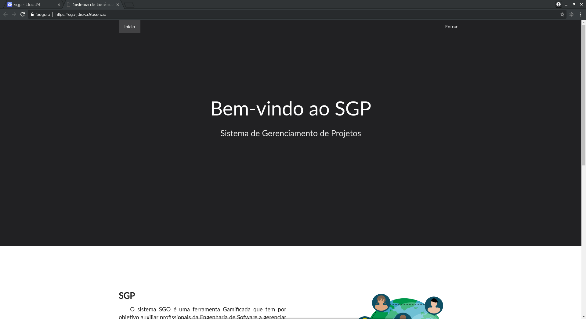

> Footer
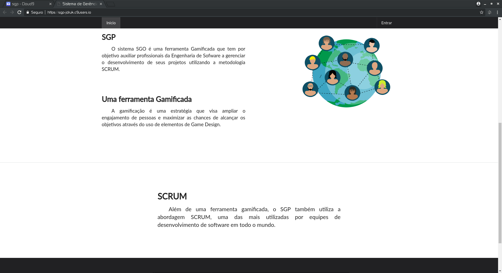

> Configurações da plataforma
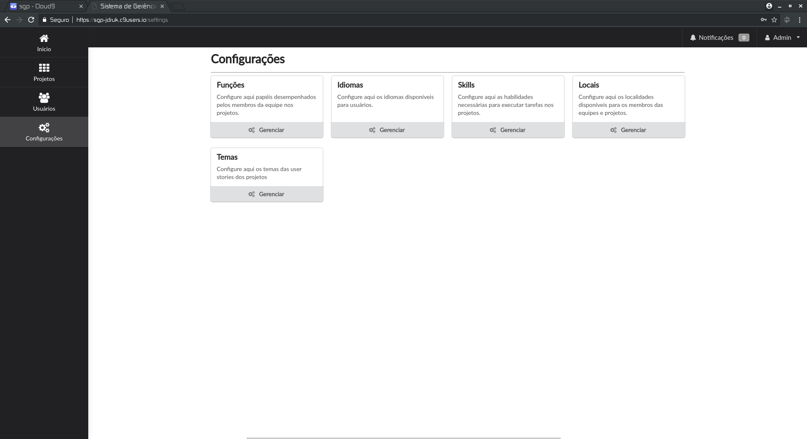

> Quadro Kanbam com as atividades da sprint e seus respectivos status
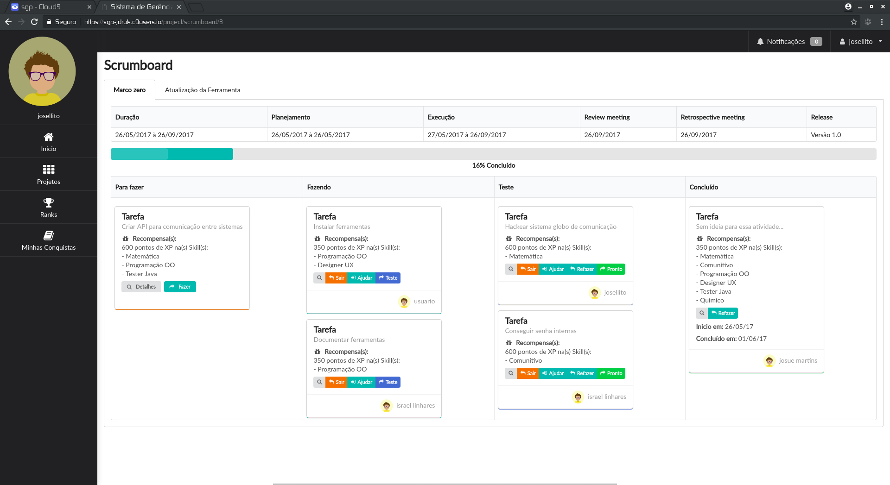

> Usuários cadastrados no sistema
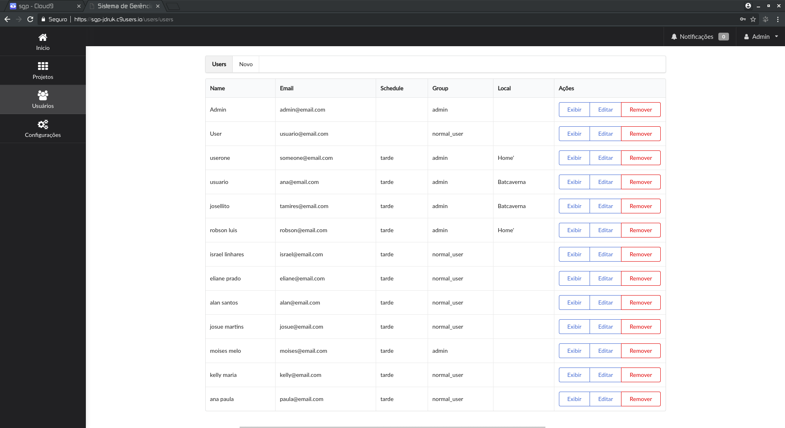

> Tela principal de configuração de um projeto
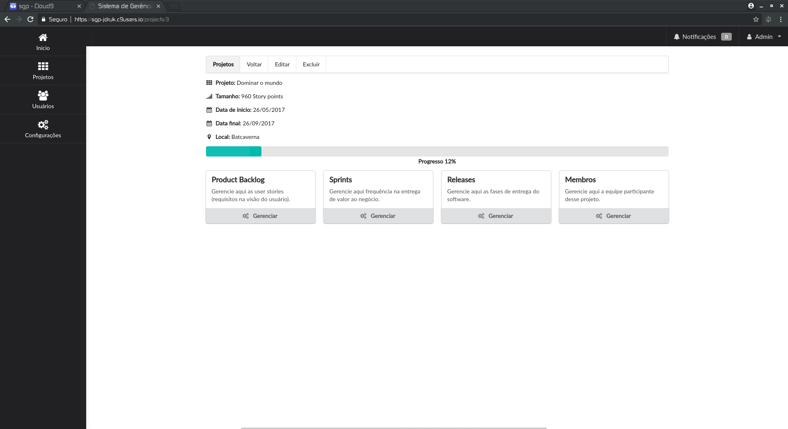

> Product backlog 
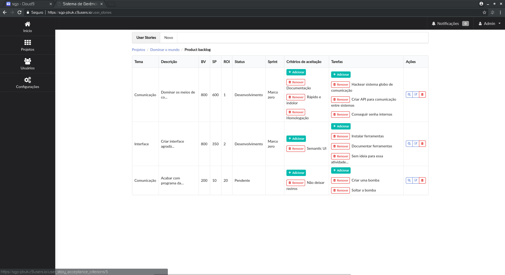

> Sprints de um projeto
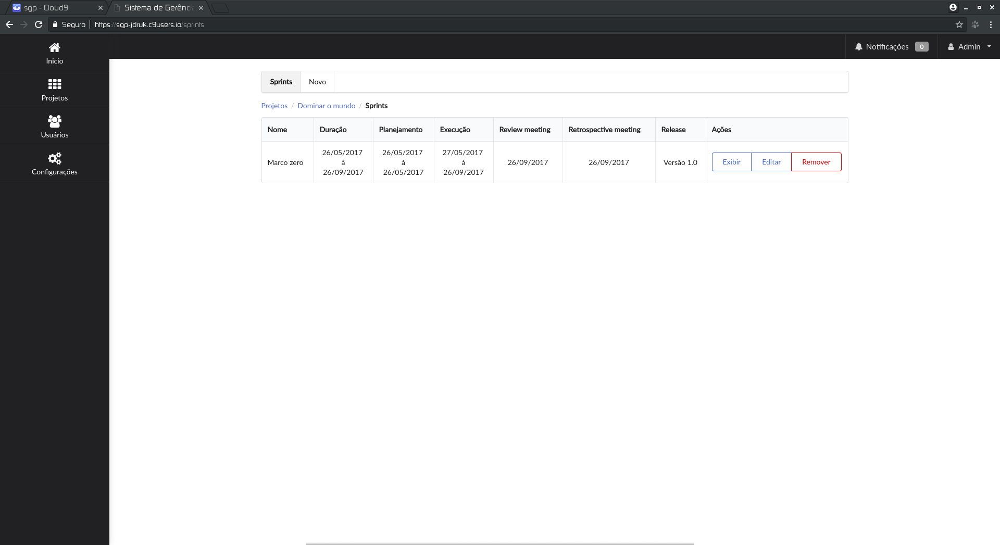

> Membros de um projeto
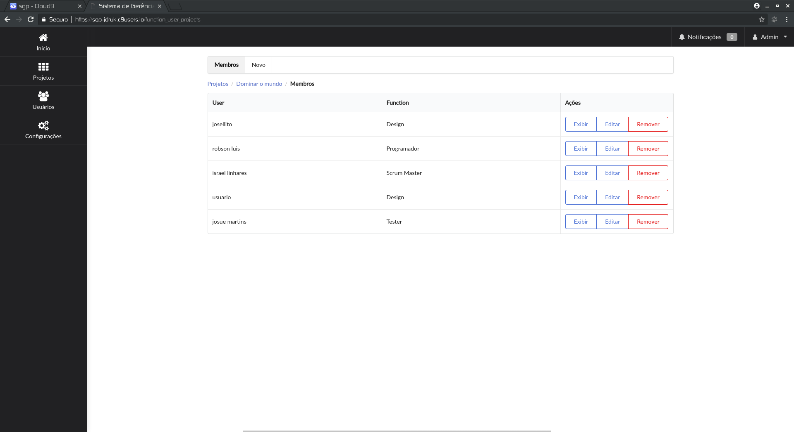

> Tela principal de um usuário normal
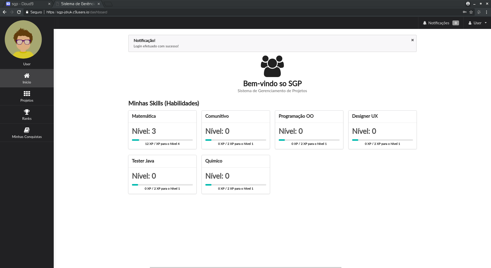

> Ranking do sistema
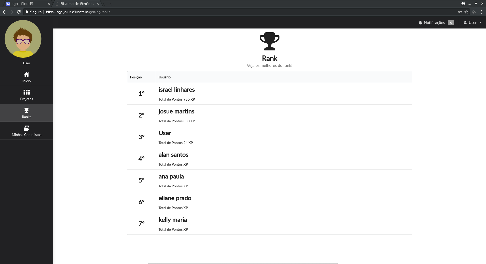

> Skills que o membro possuie
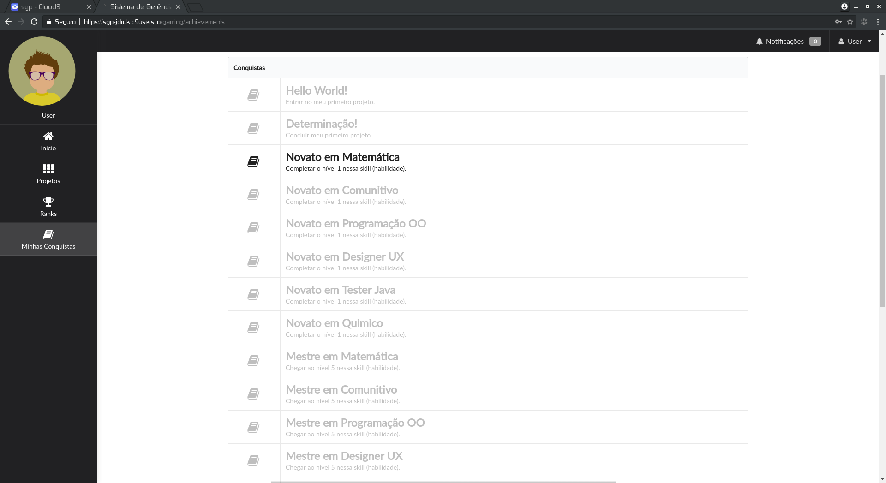

> Dashboard do usuário e os respectivos projetos as quais ele faz parte
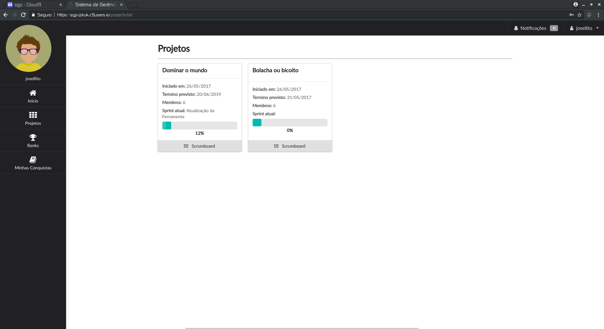

